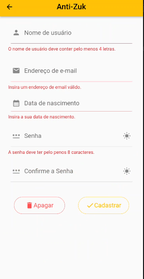
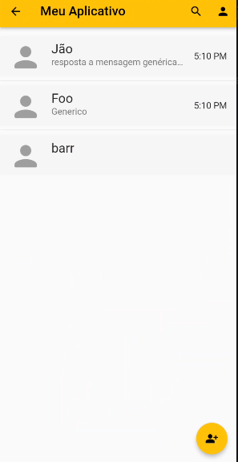
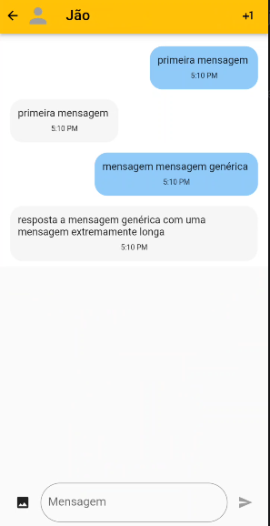

# messenger_app
Um aplicativo de mensagens desenvolvido utilizando Flutter.






## Getting Started
Para executar o projeto é necessário que 
o compilador de `Dart` e `Flutter` já estejam instalados na máquina. 
```
git clone https://github.com/FPiaa/messenger_app
cd messenger_app
flutter run
```

Após executar os comandos, o aplicativo já estará funcionando.

### Aluno
Igor Guilherme Fidler